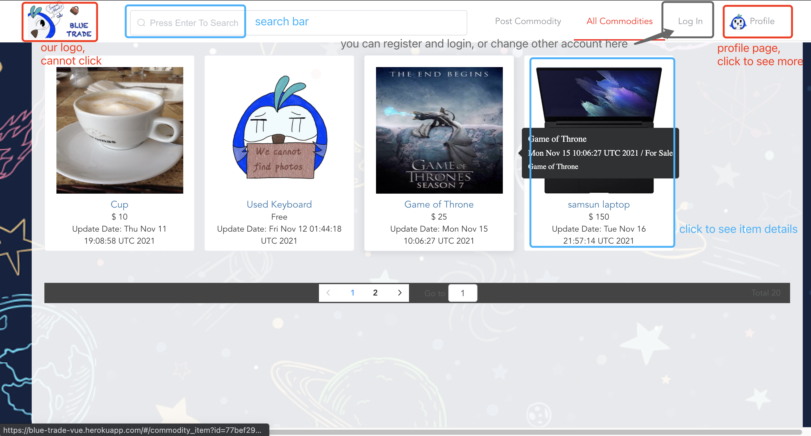

# README

## Purpose of this App:
> This application aims to help students of Johns Hopkins University to make trades with each other.
>
> It will use the student accounts to support the login function and authenticated users can browse posted items. 
Simultaneously, users can post, delete and update their own items for sale. 
Users can then initial, confirm or cancel the trades with others.
> 
> The above are the basic functions of this platform. More features will be added in the future.

## Instruction on "How to Use":

click → to view our website: [https://blue-trade-vue.herokuapp.com/](https://blue-trade-vue.herokuapp.com/)

Note: 

1. It may be very slow for the first time, Heroku needs time to awake.
2. For some pages, it may need refresh to update datas.
3. Please register and login before any other operations. :)

Main page:

Search Bar:

Personal page:

My Offers page:

Manage Goods page:

=============================================================================================================================
> This application is still under development.

The whole project is developed separately on backend and frontend.  
Back-end: Backend is a Django project in the folder "/blueTrade/".    
Front-end: Frontend is a Vue.js project in the folder "/bluejade/".  

This project can be started locally with the following instructions:
1. Before start, please make sure you have installed Python 3.7, Django, node.js, npm on your machine. 

2. To start with the backend, switch into the /blueTrade/ and run the command:
   
        $ python manage.py runserver 8888
    
    You will see the notification of starting the backend like "127.0.0.1:8888".

3. To start with the frontend switch into the /bluejade/ and run the commands one by one:

        $ npm install
        $ npm run serve

    You will see the notification of starting the frontend like "127.0.0.1:8080".

4. If you want to see the application from a user's view (from frontend), skip to step 5.
  This step is for utilizing the backend's APIs, after you start the backend. The following APIs stand for the basic CRUD functions.
   1. READ: http://localhost:8888/api/  
   You will take a look at all commodities stored in the backend

   2. READ: http://localhost:8888/api/search-form/  
   You can search commodities by submitting keywords to find related "names", "categories" or "description".  
   If you do not input any word, it will simply return every commodity.

   3. CREATE: http://localhost:8888/api/post-form/  
   You can post commodities by submitting a form here.
   The input content is "name", "owner", "category", "description",
   "price", "number of stock", "onsale" respectively.  
   You can then use the above search api to see the added commodity.
   
      1. CREATE (for image):  http://localhost:8888/api/post_image_form/  
      You can post commodity image by submitting a picture here. 
      The input content must be a file in any picture format. 
      You can use the above api to add pictures to the static directory of the local server.  
      * This api should be combined with the CREATE method together. **Do NOT** use it lonely.
   
   4. UPDATE: http://localhost:8888/api/update-form/?query=[id]  
       You can update one specific commodity by submitting a form here.
        You need to know the <id> of the commodity you want to modify, which can be found through the above search API.  
        The input content is "name", "category", "description", "price", "number of stock", "onsale" respectively.  
        You can then use the above search api to see the modified commodity.

   5. DELETE: http://localhost:8888/api/delete/?query=[id]  
       You can delete one specific commodity by utilizing this API.  
        You need to know the <id> of the commodity you want to modify, which can be found through the above search API.  
        You can then use the above search api to see the commodity removed.

5. Open the browser and visit the site "localhost:8080". This is the step to simulate the usage of the application
from the user's view.  
    1. READ: When you open this site, you will first see the whole storage of commodities inside the database listed.  
    You can always go back to this page "http://localhost:8080/commodity_list" by clicking the "All Commodities" button on the top of the page.
        1. READ (for Search): In the navigator bar on the top of the page, you can type any word to search related
        "name", "type", "description" of commodities. Your list will then be refreshed to those related to your query.  
        If you do not search for anything, you will still get all commodities in one page like when you open the website.
        2. You can see that every item in the list has some attributes including item's name, item's picture, owner's name and post date information.
    
    2. CREATE: Visit the site "http://localhost:8080/post" for posting.  
    You can then find "name", "category", "price", "picture" and "description" to input.  
    After you input these and click "POST" below, you will receive a confirmation alert for a successful posting. 
    And then you will be led to the main page again. You can also check the added item by you.

## Features
> To be developed.

1. Recommendation System (Under development)

2. Guidance on Map (Not start yet)

3. Inner Chat room (Not start yet)

4. To be added ...

## Documents:
> Please check files under "docs/" for documents.
